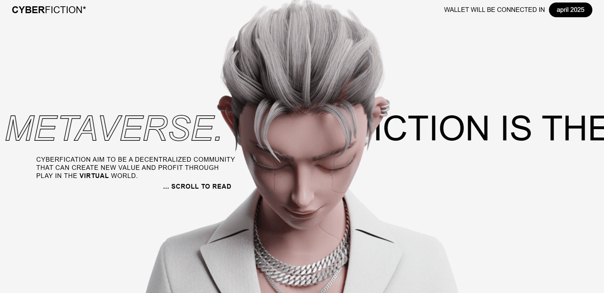

# Cyberfiction

Cyberfiction is a modern, interactive web experience designed as a digital playground in the metaverse. It focuses on community, creativity, and fun, providing users with an immersive, animated journey through themed sections.

## Features
- **Smooth Animated Scrolling:** Powered by Locomotive Scroll and GSAP ScrollTrigger for a seamless user experience.
- **Canvas-Based Animation:** Scroll-driven animation using hundreds of pre-rendered image frames.
- **Themed Sections:** Highlighting the project's philosophy: fun, play, togetherness, and creativity.

## Live Demo & Preview
- **Live Link:** [View the project live](https://abhi-zero.github.io/Cyberfiction/) <!-- Replace # with your actual live link -->
- **Preview:**
  

## Project Structure
```
├── index.html              # Main entry point
├── styles/
│   └── style.css           # CSS reset and custom styles
├── scripts/
│   └── script.js           # JS for scrolling and animation
├── assets/
│   ├── images/             # Animation frames (male0001.png ... male0300.png)
│   └── aaaaaaaaaaaa.png    # Additional image asset
```

## Getting Started
1. **Clone or download** this repository.
2. **Open** `index.html` in a modern web browser.
3. **Scroll** to experience the interactive animation and themed sections.

## Dependencies
- [GSAP (GreenSock Animation Platform)](https://greensock.com/gsap/)
- [Locomotive Scroll](https://locomotivemtl.github.io/locomotive-scroll/)
- [Google Fonts: Roboto](https://fonts.google.com/specimen/Roboto)

All external libraries are loaded via CDN in `index.html`.

## Planned Features
- **Responsive Design:** Full support for mobile and other devices is planned for a future update.

## Credits
- Inspired by and built with guidance from [All Sherian YouTube](https://www.youtube.com/@allsherian).
- Special thanks to the creators of GSAP, Locomotive Scroll, and open-source contributors.

---

Feel free to contribute or reach out with ideas and feedback! 